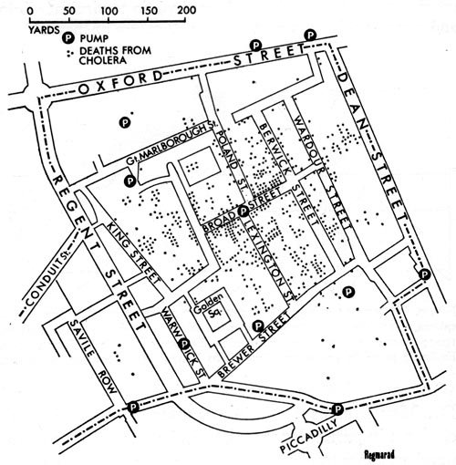
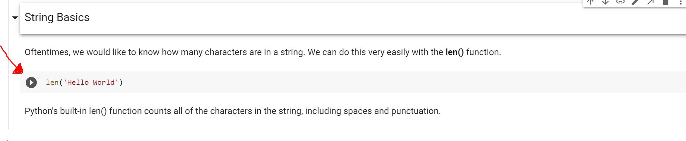
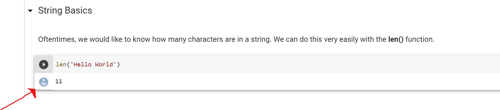
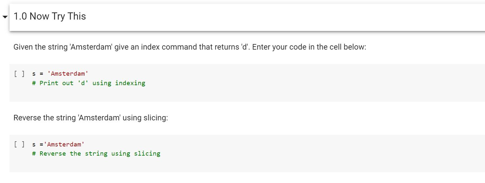
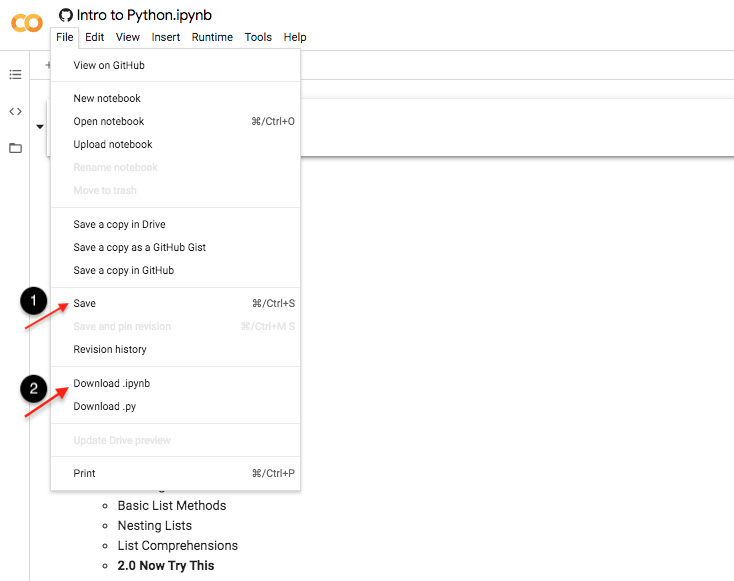

 
   

# 
 Week 1: Introduction to Digital History
       

## About this Course
Welcome to Week 1 of the Introduction to Digital History. This is an exciting step we will be taking into understanding the world of digital data and how to use and analyze it.

Before we get started, first let's dive into exactly what this course is:

The first class of the weeks consists of discussion and research on about related topics that vary from historical to recently recorded datasets. 

The second class of the weeks are meant to help prepare for these discussions. This portion of the course is a venture BitProject and California State Fullerton have begun to introduce the humanities curriculum with modern analytical thinking tools, primarily implemented through programming.

## 🛠 Our Toolkit
                                        

- Python and Numpy
- Pandas for DataFrame Processing
- Matplotlib for simple visualizations
- Seaborn for advanced visualizations

### 📕 Tutorials:
There are 7 Tutorials in this course. These tutorials will focus on helping you understand the tools used for working with and analyzing data. This analysis will range from beginner friendly to intuition based visualizations.

Every week, you will learn a new tool and how to use it effectively. We will do this by following a "building blocks" method of thinking, in which every topic will add as a step towards the end of a data processing pipeline.

You can reinforce your knowledge by working on graded 'Now Try This' exercises that are included in every tutorial notebook.

### 📗 Homeworks
Additionally, you will also have access to homeworks for the 7 Tutorials, these homeworks will be similar to the 'Now Try This' sections.

By the last tutorial, you will be ready and equipped with the complete resources to work through a dataset by utilizing the following skills:

- Understand Python base/built-in methods to work with data.
- Convert data into a table (aka DataFrame) format and clean/filter to identify meaningful data.
- Visualize numerical data and find simple patterns.
- Visualize categorical data and perform statistical analysis to draw conclusion.
- Understand the concept of data modeling.

### 📘 Practicums:
There are 3 practicums in this course. 
- Practicum 1 is an individual assignment and requires you to use the concepts learned from Weeks 2,3 and 4. You will be working through the dataset step-by-step to draw insightful information using the resources provided.
- Practicum 2 is a group-based assignment which will involve using concepts from Weeks 2 through Weeks 8. For this lab, you will be going more in-depth with the dataset provided and will write a report on your findings.
- Practicum 3 is a two-week final project. This lab will allow you to choose one of the datasets provided and apply the complete data analysis pipeline from start to end. This will give you an opportunity to document your process and your results, in which you will present a final report that details your conclusions and insights.

### 📝 Grading:
#### Tutorials:
The tutorials include multiple assignments called 'Now Try This', which are in-class exercises added in place to help students apply freshly learned concepts. Every 'Now Try this' assignment is worth a point. For this course, we have limited the number of baseline-graded 'Now Try This' assignments to 10 per notebook. If a student attempts more than 10, they can be counted as extra credit (.25 points each).

#### Practicums:
The Practicums have interlinking questions, in which every question is worth a point. The same rule for extra credit in Tutorials applies for Practicums as well, except that every question after the first 20 Practicum question attempts will be counted as extra credit.

### Content Collaborators
For Further Questions you can contact:
| Developers | Email |
|-------------|-------|
|[@ShayanRiyaz](https://github.com/ShayanRiyaz) | shayanariyaz@gmail.com |
|[@Atuljayaram](https://github.com/atuljayaram) | atjayaram@ucdavis.edu|
|[@NaraeLee](https://github.com/narae970210/Narae-Lee) | narae970210@gmail.com|

## 📈 What is Data Science and Analytics?

There’s a joke that says a data scientist is someone who knows more statistics than a computer scientist and more computer science than a statistician. (I didn’t say it was a good joke.) In fact, some data scientists are—for all practical purposes—statisticians, while others are fairly indistinguishable from software engineers. Some are machine learning experts, while others couldn’t machine-learn their way out of kindergarten. Some are PhDs with impressive publication records, while others have never read an academic paper (shame on them, though). In short, pretty much no matter how you define data science, you’ll find practitioners for whom the definition is totally, absolutely wrong.

Nonetheless, we won’t let that stop us from trying. We’ll say that a data scientist is someone who extracts insights from messy data. Today’s world is full of people trying to turn data into insight.
Some study cases are:
- The dating site OkCupid asks its members to answer thousands of questions in order to find the most appropriate matches for them. But it also analyzes these results to figure out innocuous-sounding questions you can ask someone to find out how likely someone is to sleep with you on the first date.
- Facebook asks you to list your hometown and your current location, ostensibly to make it easier for your friends to find and connect with you. But it also analyzes these locations to identify global migration patterns and where the fanbases of different football teams live.
- As a large retailer, Target tracks your purchases and interactions, both online and in-store. And it uses the data to predictively model which of its customers are pregnant, to better market baby-related purchases to them.
- In 2012, the Obama campaign employed dozens of data scientists who data-mined and experimented their way to identifying voters who needed extra attention, choosing optimal donor-specific fundraising appeals and programs, and focusing get-out-the-vote efforts where they were most likely to be useful. And in 2016 the Trump campaign tested a staggering variety of online ads and analyzed the data to find what worked and what didn’t.

**One of the main subsets of Data Science is Data Analytics**

Data analytics is the science of analyzing raw data in order to make conclusions about that information. Many of the techniques and processes of data analytics have been automated into mechanical processes and algorithms that work over raw data for human consumption.

Data analytics techniques can reveal trends and metrics that would otherwise be lost in the mass of information. This information can then be used to optimize processes to increase the overall efficiency of a business or system.

Without data analysis, we wouldn't be able to advance as fast to the point where were are today. The reason a field such as data analysis is very important is because, in many cases it is better for us to draw conclusions through our own intuition. This is particularly because of our inate ability to simplify complex patterns in order to be able to comprehend them.

**One known example is of John Snow (Not the Game of Thrones character)**

John Snow was a British doctor who used data collection and data analysis to trace the source of a cholera outbreak in central London, and to come to the conclusion that cholera was transmitted by “an agent in the water” than by the accepted theory that it was transmitted by “bad air”.  

Snow used data collection to trace the cholera outbreak to two water companies who drew their water from the Thames river, virtually unfiltered. He notes that a huge, double-blind experiment fell into his lap: “No fewer than three hundred thousand people of both sexes, of every age and occupation, and of every rank and station, from gentlefolks down to the very poor, were divided into two groups without their choice, and, in most cases, without their knowledge; one group being supplied water containing the sewage of London, and amongst it, whatever might have come from the cholera patients, the other group having water quite free from such impurity.” 

Snow’s analysis of the subsequent data and his other works led to fundamental changes in water and waste management in London and other cities, saving many lives and contributing significantly to global public health.  

### Types of Data Analytics
Data analytics is broken down into four basic types.

**Descriptive analytics** describes what has happened over a given period of time. Have the number of views gone up? Are sales stronger this month than last?  
**Diagnostic analytics** focuses more on why something happened. This involves more diverse data inputs and a bit of hypothesizing. Did the weather affect beer sales? Did that latest marketing campaign impact sales? 
**Predictive analytics** moves to what is likely going to happen in the near term. What happened to sales the last time we had a hot summer? How many weather models predict a hot summer this year? 
**Prescriptive analytics** suggests a course of action. If the likelihood of a hot summer is measured as an average of these five weather models is above 58%, we should add an evening shift to the brewery and rent an additional tank to increase output. 

### 🔁 The Data Analytics Pipeline
|OSEMN Pipeline| |
|-|--------------------| 
|O| Obtaining our data | 
|S| Scrubbing / Cleaning our data |
|E| Exploring / Visualizing our data will allow us to find patterns and trends |
|M| Modeling our data will give us our predictive power as a wizard |
|N| Interpreting our data |

The first step is to determine the data requirements or how the data is grouped. Data may be separated by age, demographic, income, or gender. Data values may be numerical or be divided by category. The second step in data analytics is the process of collecting it. This can be done through a variety of sources such as computers, online sources, cameras, environmental sources, or through personnel. Once the data is collected, it must be organized so it can be analyzed. Organization may take place on a spreadsheet or other form of software that can take statistical data. The data is then cleaned up before analysis. This means it is scrubbed and checked to ensure there is no duplication or error, and that it is not incomplete. This step helps correct any errors before it goes on to a data analyst to be analyzed.

## Mode of Transmission
This is the introductory material for Bit Project’s Digital History course curriculum. This week’s material will cover the accessibility and navigational walkthrough for the tutorials and labs used in this course.

The instructional material for this course is hosted entirely online via Google Colab Jupyter Notebooks. Because of this, students will not need to install or download anything for their local system, which makes this course very easily accessible.

Each week, students will be given a link to access the assigned learning material, which consists of a Google Colab Tutorial as well as the course-curated dataset for the week. The tutorials contain all of the learning material as well as guided practice for students to apply their newly learned skills. 

## Accessing Google Colab from GitHub
The Digital History curriculum is currently hosted on Bit Project’s GitHub page. Each week features a different tutorial as labeled with the “.ipynb” file extension. In order to access the Google Colab Tutorials, students can click on the blue “Open in Colab” button at the top of the tutorial’s content section.

This will redirect to the Google Colab Jupyter Notebook environment that allows students to interact with the material and the provided exercises.
(The new page will have the url format: colab.research.google.com/github/bitprj/DigitalHistory/…)

## Running Code Blocks
Within this environment, students can read through the learning content, and interact with the material by running the code provided.
(To execute lines of code, students can either press the PLAY button on the left hand side of the code block, or press SHIFT + ENTER.)

The output for the executed code will appear underneath the code block.

## Practicing New Skills
The tutorials also feature “Now Try This” sections that allow students the opportunity to practice applying their newly learned skills. The solutions can also be provided for these exercises.

## Saving and downloading the notebooks
In order to save and download your notebook, follow the steps in the image below

