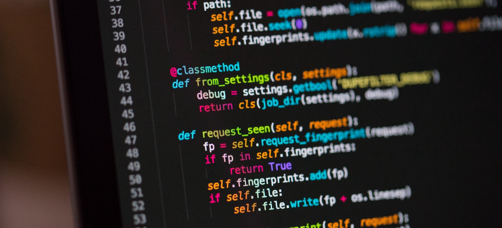

# <div align="center" Introduction to Python</div

## Recap
By this point we have looked into some important steps such as:
- Understanding data science and its scope and role in the world

## Learning Objectives
For this week, we will learn the basics of Python and creating basic programs. By the end of the week you wil be able to do the following:
- Recognize and be comfortable with Python syntax.
- Code along with an example and run a Python application.
- Be familiar with key Python data structures and associated methods.
- Understand functions and their use cases.
- Have a solid grasp of errors and exception handling.
- Be familar with modules and how to import them into your program.

## Resources
- [Python Documentation](https://docs.python.org/3/)
- [Official Python Tutorial](https://docs.python.org/3/tutorial/)
- [W3Schools Python Tutorial](https://www.w3schools.com/python/)
